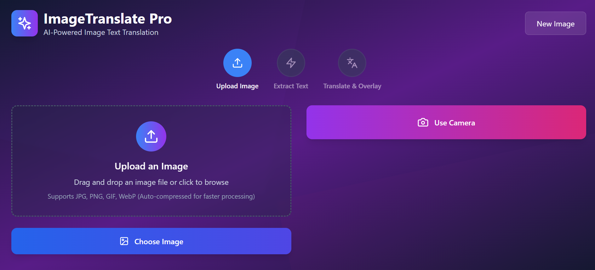
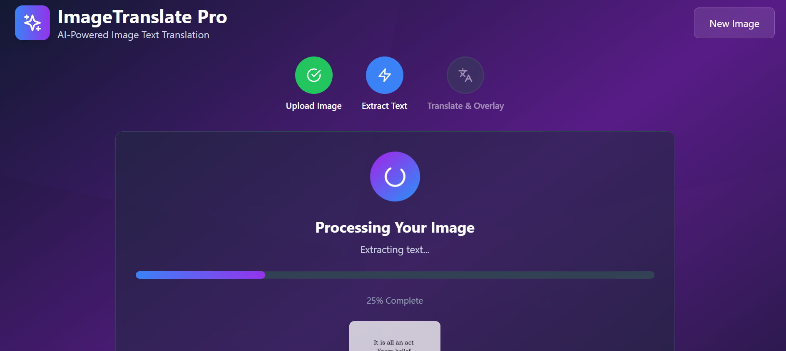
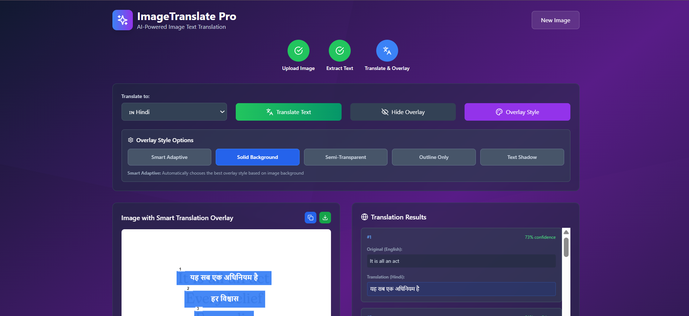

# ImageTranslate Pro 🌐📸

**Extract text from images and translate it instantly - because language barriers shouldn't exist in 2025**

Hey there! 👋 I built this tool because I was tired of manually typing out text from foreign language images just to translate them. Whether you're traveling, studying, or just curious about what that street sign says, this app has got you covered.

## Demo Screenshots

### Upload and Translate Flow


### Translation Output


### Overlay Example



 ## 🎥 Demo Video

[](https://youtu.be/o7QNl4jhoPs)


## What does this thing do?

Simple - you upload an image (or take a photo), and it:
1. Finds all the text in your image using smart OCR
2. Translates it to whatever language you want
3. Shows you the translation right on top of the original image

No more squinting at your phone trying to type foreign characters into Google Translate!

## Why I built this

I was backpacking through Seoul last year and kept running into signs I couldn't read. Sure, Google Translate has a camera feature, but it's clunky and doesn't work great offline. Plus, I wanted something that would actually overlay the translations properly so I could see exactly what each part meant.

After way too many late nights coding (and probably too much coffee), here we are!

## Features that actually matter

### 🔍 **Smart Text Detection**
- Uses Tesseract OCR (the same tech Google uses) to find text in images
- Works with 15+ languages including Korean, Japanese, Chinese, Arabic, Hindi
- Filters out blurry or low-confidence text so you don't get garbage results

### 🌍 **Real Translation (not just dictionary lookup)**
- Supports 15 languages with real translation APIs
- Falls back gracefully when APIs are down
- Groups text intelligently so you get proper sentence translations, not word-by-word nonsense

### 🎨 **Smart Overlays That Actually Work**
- Automatically picks the right text color based on your image background
- 5 different overlay styles (my personal favorite is the adaptive one)
- Overlays scale properly whether you're on mobile or desktop

### 📱 **Built for Real Use**
- Drag and drop images or use your camera
- Works great on phones (tested extensively on my iPhone and Android)
- Fast loading - I hate slow websites, so I made sure this isn't one

## Tech stuff (for the developers)

Built with React because it's what I know best, plus:
- **Vite** for lightning-fast development (seriously, the hot reload is instant)
- **Tailwind CSS** because writing custom CSS is painful
- **Framer Motion** for smooth animations that don't feel janky
- **Tesseract.js** for the OCR magic

The whole thing is optimized for speed - images get compressed automatically, components load lazily, and I've split the code so the initial load is super fast.

## Getting it running locally

You'll need Node.js (version 16 or newer). Then:

```bash
# Grab the code
git clone https://github.com/SafiyaAnsari/Image_Text_Translator.git
cd imagetranslate-pro

# Install stuff
npm install

# Fire it up
npm run dev
```

Open http://localhost:5173 and you're good to go!

## How the magic works

### The OCR Part
I'm using Tesseract.js, which is basically the gold standard for browser-based OCR. The tricky part was making it fast enough for real use - turns out you need to compress images just right and tune the OCR settings carefully.

### The Translation Part
I hit multiple translation APIs in order:
1. MyMemory (free and pretty good)
2. LibreTranslate (open source backup)
3. My own enhanced fallback system (for when the internet hates you)

### The Overlay Magic
This was the hardest part. The app actually analyzes the background color behind each piece of text and picks the best overlay style automatically. Light background? Dark text. Dark background? Light text. It sounds simple but getting it right took forever.

## File structure (if you're curious)

```
src/
├── components/
│   ├── CameraCapture.jsx      # Camera stuff
│   ├── ImageProcessor.jsx     # OCR magic happens here
│   ├── ImageUploader.jsx      # Drag & drop handling
│   └── TranslationPanel.jsx   # Translation + overlay rendering
├── App.jsx                    # Main app logic
└── main.jsx                   # Entry point
```


## License

MIT License - basically, do whatever you want with this code. If you build something cool with it, I'd love to hear about it!


If this helped you out, a star would make my day! ⭐